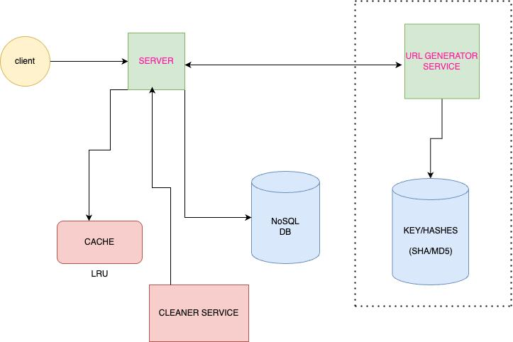

# 🔗 URL Shortener

A **production-grade**, **open-source** URL shortening service inspired by Bitly and TinyURL. Built using scalable **Spring Boot microservices** (Maven), **Angular 20**, **TailwindCSS**, **MongoDB**, and **MySQL** for an elegant full-stack experience.



---

## 🌟 Features

* 🔐 Unique & reusable hash key generation (SHA/MD5)
* 📦 URL/document store in MongoDB
* 🗃️ Hash metadata in SQL (MySQL/PostgreSQL)
* 🧹 Cleaner service to remove expired URLs
* 🚀 Built with microservices: modular and scalable
* 🎨 Responsive frontend with Angular 20 + TailwindCSS
* ⚡ Redis-ready for caching (LRU-style)
* 🔍 Coming Soon: Analytics, QR code, custom aliases

---

## 🧱 Architecture Overview

### Microservices

* **API Gateway** – Entry point using Spring Cloud Gateway
* **URL Generator Service** – Generates short hashes from long URLs
* **Cleaner Service** – Reclaims expired hashes periodically

### Data Stores

* **MongoDB** – Stores user-specific long URLs & metadata
* **MySQL/PostgreSQL** – Stores hash keys and status (active/inactive)

---

## 🖥️ Tech Stack

### Backend

* Java 17+
* Spring Boot (Maven)
* Spring Data JPA
* MongoDB, MySQL/PostgreSQL
* Spring Cloud Gateway

### Frontend

* Angular 20
* Tailwind CSS
* Angular CLI (no Node.js backend)

### DevOps

* Docker
* GitHub Actions (CI/CD)

---

## 📦 Installation & Setup

### 🔧 Prerequisites

* Java 17 or higher
* Angular CLI (`npm install -g @angular/cli`)
* Docker

### 📥 Clone Repository

```bash
git clone https://github.com/<your-username>/url-shortener.git
cd url-shortener
```

### 🚀 Backend Setup

```bash
cd backend
mvn clean install
mvn spring-boot:run
```

### 🌐 Frontend Setup

```bash
cd frontend/angular-app
npm install
ng serve
```

### 🛢️ Start MongoDB (Docker)

```bash
docker run -d -p 27017:27017 --name mongo mongo
```

---

## 📡 API Endpoints

### POST `/shorten`

```json
{
  "url": "https://example.com"
}
```

**Response:**

```json
{
  "shortUrl": "https://sho.rt/abc123"
}
```

### GET `/{shortKey}`

Redirects to the original long URL.

---

## 🧠 Database Schemas

### MongoDB (Document Store)

```json
{
  "user_id": "123",
  "short_url": "sho.rt/abc123",
  "long_url": "https://example.com/page",
  "expiration_date": "2025-08-01T00:00:00Z"
}
```

### MySQL (Hash Store)

```sql
CREATE TABLE hash_keys (
  id BIGINT PRIMARY KEY AUTO_INCREMENT,
  hash VARCHAR(255) UNIQUE,
  is_active BOOLEAN DEFAULT true
);
```

---

## 🤝 Contribution Guide

We welcome contributions from everyone!

### 🚀 Get Started

1. Fork this repository
2. Create a new branch
3. Make your changes
4. Open a Pull Request

### 🏷️ Labels to Check

* `good first issue`
* `help wanted`

📄 Refer to [CONTRIBUTING.md](CONTRIBUTING.md) for details.

---

## 📁 Project Structure

```
url-shortener/
├── backend/                # Spring Boot services
│   ├── url-service/
│   ├── user-service/
│   ├── cleaner-service/
│   └── api-gateway/
├── frontend/
│   └── angular-app/        # Angular 20 + TailwindCSS
├── docs/
│   ├── system-design.png   # Architecture diagram
│   └── architecture.md
├── README.md
├── CONTRIBUTING.md
├── LICENSE
└── .github/
    └── ISSUE_TEMPLATE/
```

---

## 📜 License

This project is licensed under the MIT License. See [LICENSE](LICENSE) for more info.

---

## 💡 Roadmap / Future Enhancements

*   QR Code generation
*   Custom aliases
* 📈 Analytics dashboard
* ⏱️ URL expiration logic
* 🔐 Rate limiting & abuse protection
* 🌐 Deployment on cloud (AWS/GCP/Azure)

---

## 🙌 Join the Community

If you like this project, give it a ⭐ and share it!

> Let’s build the most elegant, microservices-based URL shortener together!
